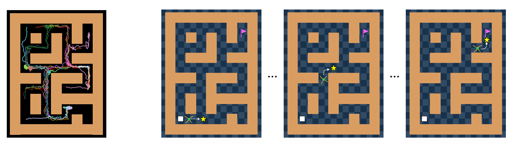

# Guide to Control (Guider):
# Offline Hierarchical Reinforcement Learning using Subgoal Generation for Long-Horizon and Sparse-Reward Tasks

This is pytorch implementation of "Guider"

Paper link:

