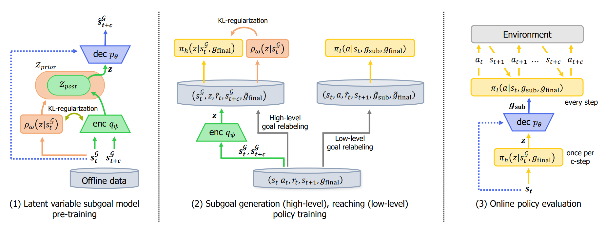

# Guide to Control (Guider)

This is pytorch implementation of "Guider" 
Paper link:

## Method

Guider consists of three parts of training: 
(1) pre-training the latent variable model which embeds reachable
subgoals in latent space via unsupervised learning 
(2) training the high-level policy to generate a subgoal that progressively
approaches a given final goal 
(3) training the low-level policy that reaches the subgoal generated at the high-level.

## Installation

## Instructions